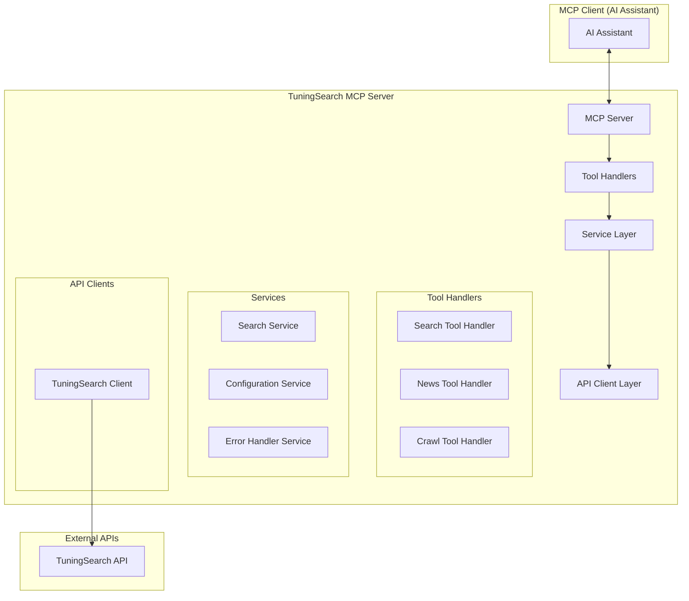

# 设计文档

## 概述

TuningSearch MCP 服务器是一个基于 Model Context Protocol (MCP) 的服务器实现，集成 TuningSearch API 为 AI 助手提供强大的搜索和网页抓取能力。该服务器遵循 MCP 协议规范，提供标准化的工具接口，使 AI 助手能够通过统一的协议访问 TuningSearch 的搜索、新闻搜索和网页抓取功能。

## 架构

### 整体架构



### 技术栈

- **运行时**: Node.js (v18+)
- **语言**: TypeScript
- **MCP SDK**: @modelcontextprotocol/sdk
- **HTTP 客户端**: fetch API (原生)
- **配置管理**: 环境变量
- **错误处理**: 自定义错误类 + 重试机制
- **日志记录**: console 或 winston
- **构建工具**: TypeScript Compiler (tsc)
- **包管理**: npm

## 组件和接口

### 1. MCP 服务器核心

```typescript
// src/server.ts
export class TuningSearchServer {
  private server: Server;
  private searchToolHandler: SearchToolHandler;
  private newsToolHandler: NewsToolHandler;
  private crawlToolHandler: CrawlToolHandler;

  constructor() {
    // 初始化 MCP 服务器
    // 设置工具处理器
    // 配置错误处理
  }

  async run(): Promise<void> {
    // 启动服务器
  }
}
```

### 2. 工具定义

#### 搜索工具 (tuningsearch_search)
```typescript
interface SearchToolArgs {
  q: string;                    // 搜索查询 (必需)
  language?: string;            // 语言代码 (可选)
  country?: string;             // 国家代码 (可选)
  page?: number;               // 页码 (可选, 默认: 1)
  safe?: number;               // 安全搜索级别 (可选, 默认: 0)
  timeRange?: string;          // 时间范围 (可选)
  service?: string;            // 搜索服务 (可选)
}
```

#### 新闻搜索工具 (tuningsearch_news)
```typescript
interface NewsToolArgs {
  q: string;                    // 新闻搜索查询 (必需)
  language?: string;            // 语言代码 (可选)
  country?: string;             // 国家代码 (可选)
  page?: number;               // 页码 (可选, 默认: 1)
  timeRange?: string;          // 时间范围 (可选)
  service?: string;            // 新闻服务 (可选)
}
```

#### 网页抓取工具 (tuningsearch_crawl)
```typescript
interface CrawlToolArgs {
  url: string;                  // 要抓取的 URL (必需)
}
```

### 3. API 客户端层

```typescript
// src/clients/tuningsearch-client.ts
export class TuningSearchClient {
  private apiKey: string;
  private baseUrl: string;
  private defaultHeaders: Record<string, string>;

  constructor(config: TuningSearchConfig) {
    // 初始化配置
    // 设置认证头
    // 配置重试机制
  }

  async search(params: SearchParams): Promise<SearchResponse> {
    // 实现搜索 API 调用
  }

  async searchNews(params: NewsParams): Promise<NewsResponse> {
    // 实现新闻搜索 API 调用
  }

  async crawl(params: CrawlParams): Promise<CrawlResponse> {
    // 实现网页抓取 API 调用
  }
}
```

### 4. 服务层

```typescript
// src/services/search-service.ts
export class SearchService {
  constructor(private client: TuningSearchClient) {}

  async performSearch(args: SearchToolArgs): Promise<ToolResponse> {
    // 验证参数
    // 调用 API
    // 格式化响应
    // 处理错误
  }

  async performNewsSearch(args: NewsToolArgs): Promise<ToolResponse> {
    // 类似搜索实现
  }

  async performCrawl(args: CrawlToolArgs): Promise<ToolResponse> {
    // 类似抓取实现
  }
}
```

### 5. 工具处理器

```typescript
// src/handlers/search-tool-handler.ts
export class SearchToolHandler {
  constructor(private searchService: SearchService) {}

  async handleSearchRequest(args: any): Promise<ToolResponse> {
    // 验证参数
    // 调用服务
    // 返回 MCP 格式的响应
  }
}
```

## 数据模型

### 配置模型

```typescript
interface TuningSearchConfig {
  apiKey?: string;              // API 密钥
  baseUrl?: string;             // API 基础 URL
  timeout?: number;             // 请求超时时间
  retryAttempts?: number;       // 重试次数
  retryDelay?: number;          // 重试延迟
}
```

### API 响应模型

```typescript
interface SearchResult {
  title: string;
  url: string;
  content: string;
  position: number;
  sitelinks?: SiteLink[];
}

interface SearchResponse {
  success: boolean;
  data: {
    query: string;
    results: SearchResult[];
    suggestions?: string[];
  };
  message: string;
  code: string;
}

interface NewsResult {
  title: string;
  url: string;
  content: string;
  position: number;
  publishedDate?: string;
  source?: string;
}

interface CrawlResult {
  url: string;
  title: string;
  content: string;
  metadata?: Record<string, any>;
}
```

### MCP 工具响应模型

```typescript
interface ToolResponse {
  content: Array<{
    type: 'text';
    text: string;
  }>;
  isError?: boolean;
}
```

## 错误处理

### 错误类型层次

```typescript
abstract class TuningSearchError extends Error {
  abstract readonly code: string;
  abstract readonly statusCode: number;
}

class APIKeyError extends TuningSearchError {
  readonly code = 'API_KEY_ERROR';
  readonly statusCode = 401;
}

class RateLimitError extends TuningSearchError {
  readonly code = 'RATE_LIMIT_ERROR';
  readonly statusCode = 429;
}

class NetworkError extends TuningSearchError {
  readonly code = 'NETWORK_ERROR';
  readonly statusCode = 500;
}
```

### 重试策略

```typescript
interface RetryConfig {
  maxAttempts: number;          // 最大重试次数
  initialDelay: number;         // 初始延迟 (毫秒)
  maxDelay: number;             // 最大延迟 (毫秒)
  backoffFactor: number;        // 退避因子
  retryableErrors: string[];    // 可重试的错误代码
}
```

### 错误处理流程

1. **API 调用失败**: 检查错误类型，决定是否重试
2. **重试机制**: 指数退避策略，最多重试 3 次
3. **错误格式化**: 将错误转换为用户友好的消息
4. **日志记录**: 记录详细的错误信息用于调试

## 测试策略

### 单元测试

- **API 客户端测试**: 模拟 HTTP 请求和响应
- **服务层测试**: 测试业务逻辑和错误处理
- **工具处理器测试**: 验证 MCP 协议兼容性
- **配置管理测试**: 测试环境变量解析

### 集成测试

- **端到端测试**: 完整的 MCP 工具调用流程
- **API 集成测试**: 真实 API 调用 (使用测试密钥)
- **错误场景测试**: 网络错误、API 限制等

### 测试工具

- **测试框架**: Jest
- **HTTP 模拟**: msw (Mock Service Worker) 用于 fetch API
- **MCP 测试**: @modelcontextprotocol/sdk 测试工具

## 部署和配置

### 环境变量

```bash
# 必需配置
TUNINGSEARCH_API_KEY=your_api_key_here

# 可选配置
TUNINGSEARCH_BASE_URL=https://api.tuningsearch.com/v1
TUNINGSEARCH_TIMEOUT=30000
TUNINGSEARCH_RETRY_ATTEMPTS=3
TUNINGSEARCH_RETRY_DELAY=1000
TUNINGSEARCH_LOG_LEVEL=info
```

### MCP 客户端配置

#### Claude Desktop 配置
```json
{
  "mcpServers": {
    "tuningsearch": {
      "command": "node",
      "args": ["/path/to/tuningsearch-mcp-server/dist/index.js"],
      "env": {
        "TUNINGSEARCH_API_KEY": "your_api_key_here"
      }
    }
  }
}
```

#### NPX 运行配置
```json
{
  "mcpServers": {
    "tuningsearch": {
      "command": "npx",
      "args": ["-y", "tuningsearch-mcp-server"],
      "env": {
        "TUNINGSEARCH_API_KEY": "your_api_key_here"
      }
    }
  }
}
```

### 构建和打包

```json
{
  "scripts": {
    "build": "tsc",
    "start": "node dist/index.js",
    "dev": "ts-node src/index.ts",
    "test": "jest",
    "lint": "eslint src/**/*.ts",
    "package": "npm pack"
  }
}
```

## 性能考虑

### 缓存策略

- **响应缓存**: 缓存搜索结果 (可配置 TTL)
- **配置缓存**: 缓存 API 配置避免重复解析
- **错误缓存**: 临时缓存失败的请求避免重复调用

### 限流处理

- **请求队列**: 管理并发请求数量
- **速率限制**: 遵守 API 速率限制
- **优雅降级**: API 不可用时的备用策略

### 内存管理

- **流式处理**: 大型响应的流式处理
- **垃圾回收**: 及时清理不需要的对象
- **内存监控**: 监控内存使用情况

## 安全考虑

### API 密钥管理

- **环境变量**: 通过环境变量传递 API 密钥
- **密钥验证**: 启动时验证 API 密钥有效性
- **密钥轮换**: 支持运行时更新 API 密钥

### 输入验证

- **参数验证**: 严格验证所有输入参数
- **URL 验证**: 验证抓取 URL 的安全性
- **注入防护**: 防止各种注入攻击

### 网络安全

- **HTTPS**: 强制使用 HTTPS 连接
- **证书验证**: 验证 SSL 证书
- **超时设置**: 设置合理的网络超时

## 监控和日志

### 日志级别

- **ERROR**: 错误和异常
- **WARN**: 警告信息 (如 API 限制)
- **INFO**: 一般信息 (如请求开始/完成)
- **DEBUG**: 调试信息 (如详细的 API 响应)

### 监控指标

- **请求计数**: 各类工具的调用次数
- **响应时间**: API 调用的响应时间
- **错误率**: 失败请求的比例
- **重试次数**: 重试机制的使用情况

### 健康检查

- **API 连通性**: 定期检查 TuningSearch API 可用性
- **配置有效性**: 验证配置参数的正确性
- **资源使用**: 监控内存和 CPU 使用情况